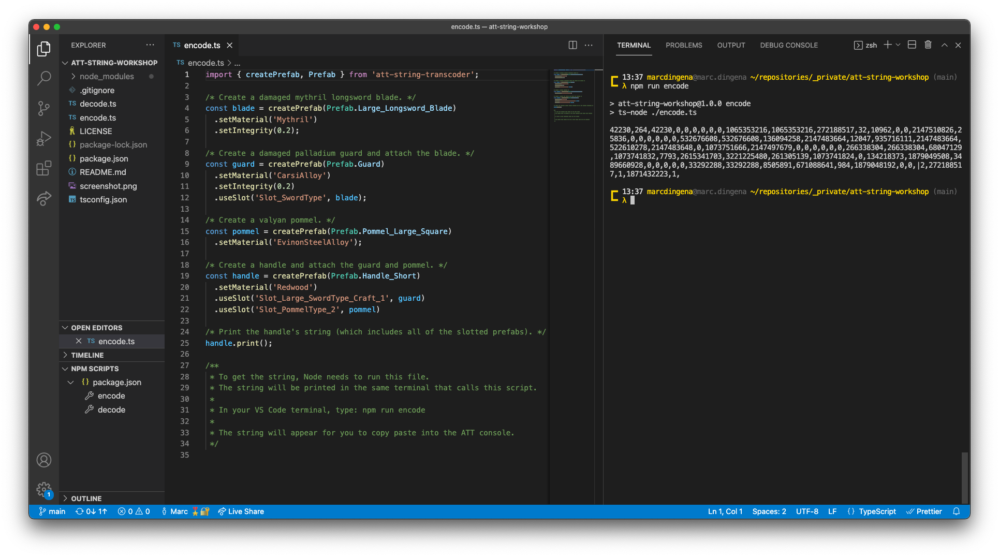

# ATT String Workshop

Template project for working with _A Township Tale_'s save string system. Allows easy creation of string weapons.

## 🚧 Prerequisites

This document assumes you're running this project in a Windows environment.

⚠️ Node version 20 or higher is required.

- `node` + `npm` ([download](https://nodejs.org/en/download/))
- VS Code ([download](https://code.visualstudio.com/))

## ⚡️ Quick Start

1. [Download this project](https://github.com/mdingena/att-string-workshop/archive/refs/heads/main.zip) (`.zip` file).
1. Unzip the file.
1. Open the unzipped directory with VS Code.
1. Hit <kbd>Ctrl</kbd> + <kbd>`</kbd> to open the terminal.
1. Install **ATT String Workshop** by typing `npm install` on the command line.
1. Open the `creations/example-longsword.ts` file in the project and create your weapon or contraption.
1. ⚠️ Don't forget to save the file when you're done making changes! You can hit <kbd>Ctrl</kbd> + <kbd>S</kbd> to save.
1. In the terminal, type `npm run encode creations/example-longsword.ts` on the command line.
1. Your string will appear in the terminal for you to copy and paste!
